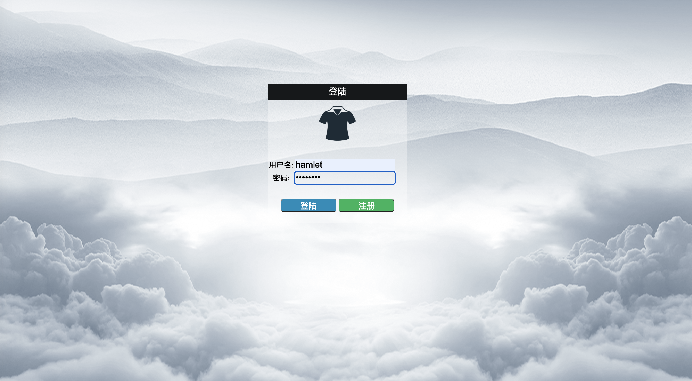
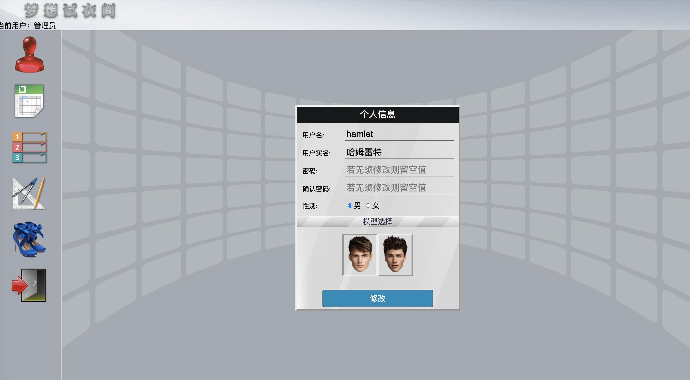
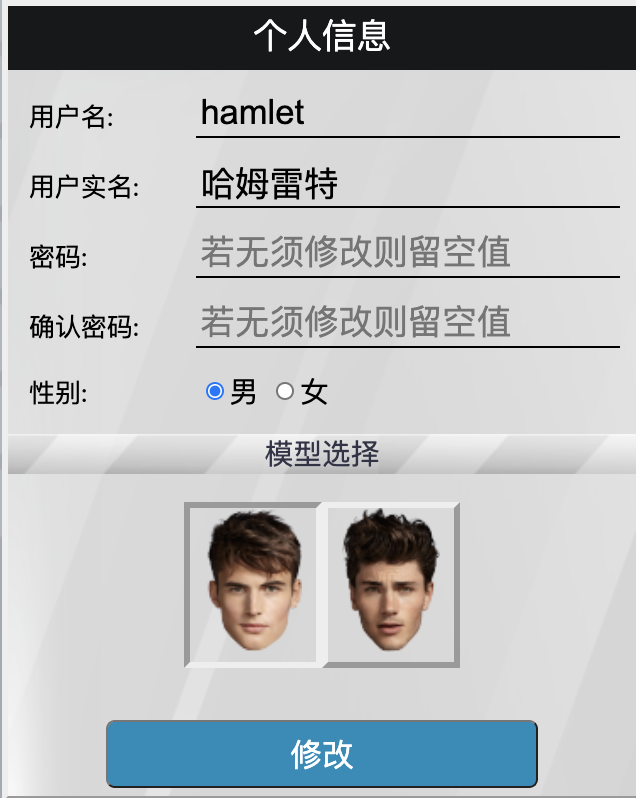
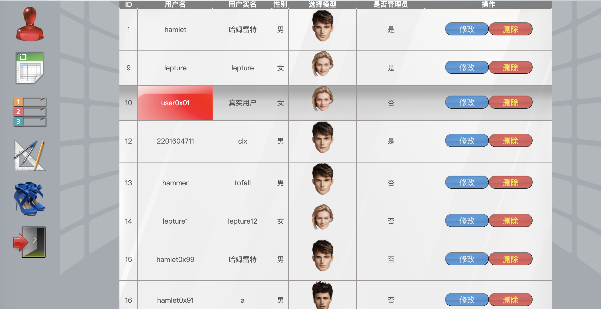
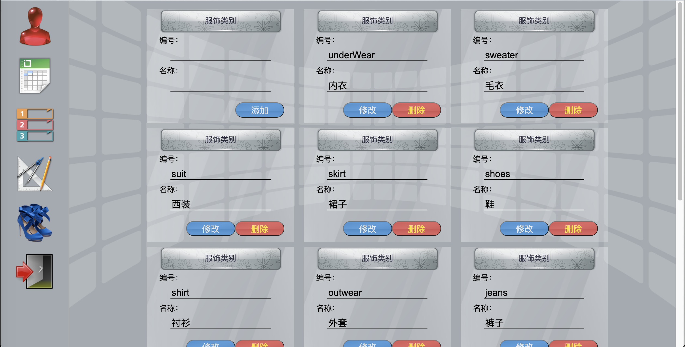
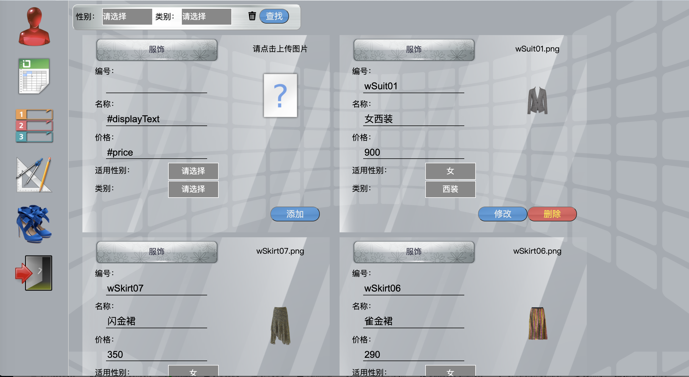
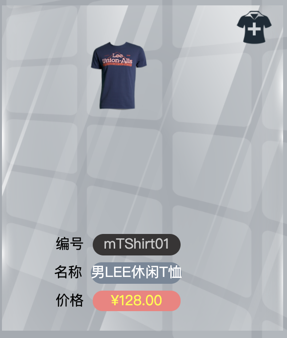
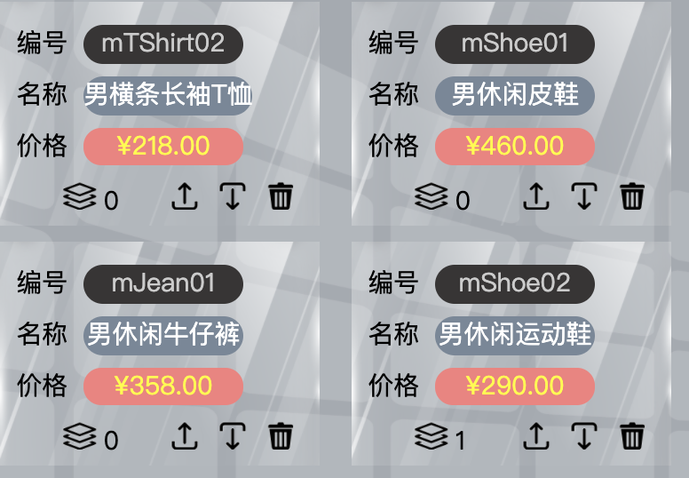

# clothing-yourself
A clothing game demo built with Spring Boot + RESTEasy.
### 项目简介
此项目是一个使用Spring Boot和RESTEasy构建的`试衣间`小游戏，案例来自在校期间的课业设计。

项目启动后，新玩家在浏览器输入`http://127.0.0.1:8080/jsp/login.jsp`进入登陆界面，在登陆界面注册账号并登入已进入游戏界面。

如不想注册账号，也可以使用以下管理员账号登陆:
- 账号:`hamlet`
- 密码:`password`



登陆后即进入个人信息页:



左侧边栏的图表含义从上至下依次如下:
1. 个人信息
2. 用户管理(需要管理员权限)
3. 服饰类别管理
4. 服饰管理
5. 衣帽间
6. 退出当前账号
#### 个人信息维护
在`个人信息`窗口中，可以修改用户名、密码等信息，还可以更换当前的模特型号。



#### 用户信息管理(需要管理员权限)
`用户信息管理`窗口中将显示所有用户的个人信息，管理员用户可以在该窗口中:
- 修改用户个人信息
- 删除用户
- 修改用户权限


#### 服饰类别管理
`服饰类别管理`窗口可以查询到所有服饰类别的数据，如果用户是管理员，还能够增加、修改或删除服饰类别信息。

#### 服饰管理
`服饰管理`窗口可以设定筛选参数以查询符合条件的服饰信息，查询的条件有:
- 性别
- 服饰类别
如果用户具有管理员级别的权限，则能够修改、删除或新增服饰信息。
若用户想要新增服饰信息，还可以选择上传自己喜欢的服饰图片。



#### 衣帽间
用户可以在`衣帽间`中给模特搭配上自己喜欢的衣服。


在右边的侧边栏中，每种服饰都以窗口的形式展示，用户还可以使用右上方的筛选栏来制定筛选条件。



在每种服饰窗口的右上角有`添加按钮`，用户点击该按钮能够为模特穿上该衣服。
在衣帽间的左边，可以清楚地看见模特当前已经穿着的服饰。



每种服饰都以信息窗口的形式紧凑排列在一起，在编号、名称和价格信息的正下方可以看到有一排黑色图标。

这些图标从左到右的功能依次是:
1. 指示服饰的 `z-index` 属性，也就是控制衣服之间的覆盖关系，z-index 越大的衣服摆在越前面，越小则摆在越里面，可类比穿衣的顺序。
2. 增加该服饰的`z-index`值
3. 减少该服饰的`z-index`值
4. 将该服饰从模特身上移除
### 配置项
注意修改以下配置项:
```properties
# 数据库 URL
spring.datasource.url=jdbc:sqlserver://localhost:1433;database=suit
# 数据库用户名
spring.datasource.username=sa
# 数据库密码
spring.datasource.password=passWord!
```
### 样例 Database
如要使用该项目提供的样例 Database，需要做好以下准备工作:
1. 使用 Docker 安装 mssql-sqlserver，可以参考[这里](https://www.cnblogs.com/wxc6603/p/11927073.html)
2. 将项目根目录下`/dbfiles`文件夹下的`suit.mdf`与`suit_log.LDF`复制到 docker 容器内部，可以参考以下命令:
    ```bash
    root@xxx: docker cp dbfiles/ MSSQL_1433:/var/opt/mssql/backup
    ```
3. 在 `sqlcmd`中执行以下 SQL 语句以完成数据库的覆盖:
    ```sql
        USE master
        DROP DATABASE IF EXISTS suit
        CREATE DATABASE [suit]
            ON ( FILENAME = N'C:\var\opt\mssql\backup\suit.mdf'),
            ( FILENAME = N'C:\var\opt\mssql\backup\suit_log.ldf')
            FOR ATTACH;
        GO
    ```
4. Have fun!
